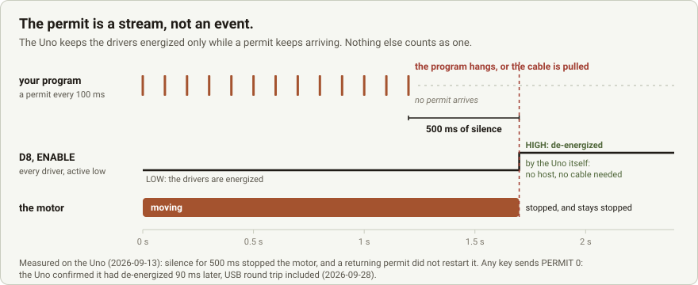
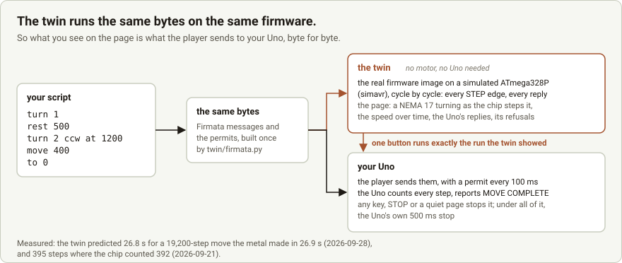

# Bombyx bench kit

**The motor stops when your program stops.** A fail-safe stepper firmware for an Arduino Uno with a CNC Shield V3,
and a digital twin that shows what the motor will do before it moves. It is the first piece of
[Bombyx](#where-this-is-going-bombyx) you can put on your bench.

<p align="center">
  <picture>
    <source media="(prefers-color-scheme: dark)" srcset="docs/permit-stream-dark.svg">
    
  </picture>
</p>

If you let a PC, a script or an AI agent drive a stepper, you know the fear: the program hangs, the cable comes loose,
and the motor keeps going. This kit makes that impossible. It is a ConfigurableFirmata sketch, a Python player, and a
twin that runs the very same firmware image on simavr, and it needs nothing else from Bombyx.

**All you need**: an Arduino Uno, a CNC Shield V3, one stepper driver (TMC2208 or A4988), a NEMA 17, and a 12–24 V
supply. If you have ever driven a stepper from an Arduino, it is already on your desk.

- **The Uno only moves while it keeps hearing "yes".** The drivers stay energized only while a *permit* arrives at
  least every 500 ms. If your program hangs or crashes, or the cable is pulled, the permits stop, and the Uno
  de-energizes the drivers by itself.
- **Any key stops it at once.** The player sends "stop" before anything else, and the Uno de-energizes.
- **The enable line belongs to the firmware.** D8, which enables every driver on the shield, cannot be driven by
  any message. A program can ask for moves, and only the firmware can energize the motors.
- **You see it first.** `bench_twin.py serve` opens a page where you write or drop a script. The real firmware runs
  it on a simulated Uno, and a NEMA 17 on the page turns exactly as the chip would step yours. With `--uno <port>`,
  one button then runs that same script on your motor.

<p align="center">
  <picture>
    <source media="(prefers-color-scheme: dark)" srcset="docs/twin-pipeline-dark.svg">
    
  </picture>
</p>

## Quick start

```bash
pip install -r requirements.txt                      # pyserial
arduino-cli core install arduino:avr@1.8.7           # once
arduino-cli lib install ConfigurableFirmata@3.3.0    # once
arduino-cli compile --fqbn arduino:avr:uno firmware/bombyx_firmata
arduino-cli upload  --fqbn arduino:avr:uno --port COM6 firmware/bombyx_firmata
python bench_twin.py serve                           # the page: write a script, watch the twin, press the motor button
```

No Uno on the desk yet? The twin runs without one: `python bench_twin.py turn 12 --show` opens the page for one run.
It needs simavr, gcc and the arduino-cli setup above, and no hardware at all. The details, and what to check on your
shield before the first move, are under [Get started](#get-started).

## Is this for you?

- **Your Python drives a stepper**, from a laptop, a Raspberry Pi, a notebook, or an AI agent you are letting loose on
  real hardware. You want the stop held by the board, not by the code that might be the thing that crashes.
- **You have an Uno and a CNC shield on the bench** and want to try moves without wondering whether a typo energizes
  the drivers and walks the motor off the desk.
- **You want to see the move before the motor makes it**: how long twelve turns take, where the shaft ends, what the
  ramps look like, and what the twin refuses.

## How it compares

| | ConfigurableFirmata as shipped | this kit |
|---|---|---|
| The host hangs, crashes, or the USB lead is pulled mid-move | the move runs to its end, and the drivers stay as the last message left them | the drivers are de-energized after 500 ms of silence, by the Uno itself, and a returning permit does not restart the move |
| ENABLE (D8), which energizes every driver on the shield | a pin like any other: any pin write can drive it | not a pin: refused by name, and not offered in the capability list |
| A malformed message | 3.3.0 trusts every index a host sends: one message naming a pin that does not exist can stop the core, and a stopped core changes no pin | a guard checks every message before the library sees it and refuses by name; the AVR's own watchdog restarts a stopped core, and ENABLE goes high before anything else |
| What a move will do, before it runs | you find out on the metal | the same firmware image runs on a simulated Uno, and the page shows the shaft, the speed, and the Uno's replies |
| Counted moves, reported complete | yes, AccelStepperFirmata | the same, unmodified |

The library is used unmodified. Everything the kit adds is in `firmware/bombyx_firmata/`: three files, and the
comments at the top of each say why it is there and what was measured.

## What was measured

On the reference bench: an Uno, a CNC Shield V3, a TMC2208 driver at 1/8 step and a NEMA 17.

| what | measured | on |
|---|---|---|
| silence for 500 ms stops the motor, and it does not start again by itself | stopped at the limit; a returning permit did not resume it | the Uno, 2026-09-13 |
| "stop" (PERMIT 0) during a move | the Uno confirmed it had de-energized 90 ms later, including the USB round trip | the Uno, 2026-09-28 |
| D8 as a target | refused by name, and not offered in the board's capability list | the Uno, 2026-09-13 |
| 12 turns as one counted move | 19,200 of 19,200 steps, one continuous movement, 26.9 s | the Uno, 2026-09-28 |
| the twin's prediction of that move | 26.8 s | the twin, same bytes |
| the twin's prediction of a 400-step move | 395 steps (the chip counted 392) | 2026-09-21 |

**Read this before you trust those numbers.** They were measured with the firmware build of 2026-09-13. The firmware
in this kit is newer. It adds a guard that checks every incoming message before the Firmata library sees it, so a
malformed message can no longer stall the chip while the motors are enabled. On the twin, the newer build makes
exactly the same steps: 1,600 for one turn, 19,200 for twelve, and a jitter that returns to 0. It is about 1.6 %
slower on long moves: the twin predicts 27.3 s for the twelve turns. Its measurements on the metal come next, and this
table will show them.

It has been measured on one shield and one kind of driver. If you run it on an A4988 or a DRV8825, or on another
motor, open an issue with what you measured and how, and the table gets a row.

## Where this is going: Bombyx

Bombyx is an operating system on the seL4 microkernel, built on one rule: an AI may ask for movement, but only a
person, with a physical key on the machine, can allow it. A verified kernel keeps the AI away from the motors, and
this firmware is the last link in that chain: it is what the Bombyx core talks to over USB.

The kit is that link on its own. The stop you measure on your bench is the stop Bombyx relies on, and the twin that
shows you a move first is what Bombyx runs on a plan before a person sees it, and what lets it refuse one. The
kernel, the key and the rest of the system are the release.

**Bombyx is not released yet.** Star or watch this repository: the release will be announced here first. Until then,
this is the part you can hold, measure and take apart.

## What is in the kit

| | |
|---|---|
| `firmware/bombyx_firmata/` | the firmware: ConfigurableFirmata, plus the permit watchdog, the message guard, and D8 kept out of reach |
| `firmware/en_probe/` | the probe the page puts on the Uno for half a minute to measure what holds your shield's EN line |
| `bench_twin.py`, `twin/`, `twin_view_template.html` | the twin: the firmware image on simavr, the prediction, and the page |
| `bench_player.py` | the command-line player: `turn`, `move`, `play`, `run`, and `--dry-run` for the exact bytes |
| `shows/` | four timed shows (`sine`, `scale8`, `jitter`, `mario`) that the player and the twin both take |
| `twin/wiring.json`, `twin/bench_facts.json` | your bench, as the twin reads it: which slot has a motor, and what was measured on your shield |
| `docs/` | the two figures above, and `figures.py`, which draws them |

## Get started

The short version: flash the firmware (two `arduino-cli` commands), put the motor in slot Z, measure your shield once
from the page, then write a script on the page, watch the twin, and press the motor button. In detail:

### What you need

- An Arduino Uno (or a compatible board with an ATmega328P at 16 MHz)
- A CNC Shield V3, with **no cap on its EN/GND pins** (a cap there enables the drivers whatever the firmware does)
- A stepper driver per motor (TMC2208 or A4988), and a NEMA 17 stepper
- A 12–24 V supply for the shield
- Python 3.9 or newer, and `pip install -r requirements.txt`
- To flash the firmware: [arduino-cli](https://arduino.github.io/arduino-cli/) with the `arduino:avr` core and the
  **ConfigurableFirmata 3.3.0** library from the [Firmata project](https://github.com/firmata/ConfigurableFirmata)
  (the version this kit was tested with; it installs its own dependencies)
- For the twin: simavr 1.6 with `libsimavr-dev`, `libelf-dev` and `gcc` (Linux or macOS; on Windows inside WSL's
  Ubuntu-22.04), and the arduino-cli setup above. The twin needs no motor, no shield and no Uno.

### 1. Flash the firmware

```bash
arduino-cli core install arduino:avr@1.8.7
arduino-cli lib install ConfigurableFirmata@3.3.0
arduino-cli compile --fqbn arduino:avr:uno firmware/bombyx_firmata
arduino-cli upload --fqbn arduino:avr:uno --port COM6 firmware/bombyx_firmata
```

Use your own port (`/dev/ttyACM0`, `/dev/ttyUSB0`, `COM3`, ...). The board answers as **BombyxFirmata**, and the
player refuses to drive a board that does not.

### 2. Wire it

Put the motor in slot **Z** (STEP D4, DIR D7) to begin with. X is D2/D5 and Y is D3/D6. D8 enables every slot, and it
stays the firmware's. Set the driver's current before the first run. Power the shield before you start a move.

### 3. Measure your shield once

The twin will not clear a plan whose safety depends on something nobody has measured. Two facts about your shield
decide what the drivers do while the Uno restarts, which happens every time a program opens the port:

1. **Is there a cap on the EN/GND pins?** There must not be.
2. **What holds EN while nothing drives it?** It must be held high, so the drivers stay off during a restart.

**The page measures it for you.** Start the page (step 4), check that it shows your Uno's port, and press **Measure my
shield**. For about half a minute the Uno runs a small probe (`firmware/en_probe`) that reads its own EN line. Two
control pins must read as expected, or the answer is not believed: D0, held high by the USB chip, and A5, with nothing
on it. STEP and DIR are held low throughout, so nothing can move. Then the page puts back the firmware it twins,
checks that the Uno says it runs BombyxFirmata, and writes what was measured into `twin/bench_facts.json`.

- **EN held high**: the drivers stay off while the Uno restarts. It also shows there is no cap on EN/GND.
- **EN held low**: a cap on EN/GND, or a pull-down. Take the cap off if there is one; if not, fit a 10 kOhm resistor
  from EN to 5 V. Then measure again.
- **Nothing holds EN**: fit a 10 kOhm resistor from EN to 5 V, then measure again.

**With a meter instead.** Look at the EN/GND pins: no cap. Then hold the Uno's reset button and measure EN to GND:
about 5 V means the drivers stay off during a restart. Write what you found into `twin/bench_facts.json` under
`shield`, for example:

```json
"en_gnd_jumper_fitted": {"value": false, "provenance": "MEASURED", "source": "looked, 2026-10-01"},
"en_pull": {"value": "up", "provenance": "MEASURED", "source": "4.9 V with reset held, 2026-10-01"}
```

Also describe your motors in `twin/wiring.json` (`actuators`): one entry per slot with a motor.

### 4. See it first: the twin page

```bash
python bench_twin.py serve                   # the page, on http://127.0.0.1:8740: write or drop a script, see it
python bench_twin.py serve --uno COM6        # name your Uno's port yourself (otherwise the page finds it)
python bench_twin.py serve --sketch DIR      # your Uno runs another build of the firmware: the twin runs that one
```

**Your Uno.** The page lists the serial ports on this computer, without opening any, and takes the Uno when there is
exactly one; choose another from the list. *Ask what it runs* opens that port and asks the board for its firmware's
name, and nothing else. *Measure my shield* is step 3.

The page shows:
- **a NEMA 17 seen from the front**, with a pointer on its shaft. It turns exactly as the simulated chip steps it,
  at real speed, slowed down or sped up;
- the speed over time, with the ramp up, the cruise and the ramp down;
- the Uno's own replies (MOVE COMPLETE, de-energized) at the moment it would send them;
- anything the twin refuses, and why.

**Your own scripts.** Type one on the page, or drop a `.txt` file on it, then press *Show it on the twin*. One step
per line, or several separated by `;`:

```text
turn 1                        # one turn clockwise (ccw for the other way)
rest 500                      # hold still for 500 ms
turn 2 ccw at 1200 accel 4000 # faster: 1200 steps/s, ramping at 4000 steps/s^2 (accel 0 = constant speed)
move 400                      # 400 steps from where the shaft is
to 0                          # back to where the script began
```

`at` and `accel` stay in force for the steps after them. A show file (`shows/*.txt`) can be dropped on the page too.

**On your motor.** Once the page has your Uno's port, it has a button that runs **exactly the run the twin just
showed**:
- change the script, the slot or the direction, and the button waits until you show it on the twin again;
- the *reverse direction* box starts from `dir_invert` in `twin/wiring.json` for the slot. If a run turns the wrong
  way, press *Record that it turns the other way* under the button: it is written there, and the next run turns
  the right way. (`bench_player.py` on the command line does not read it: give it `--reverse` yourself);
- the button stays off while the twin refuses anything, so a new kit moves no motor until you have measured your
  shield (step 3);
- it asks once, *"This will move your motor: …, about … s"*, and then starts;
- while it runs, the big STOP button or any key on the page stops it. Closing the page stops it too: the page says
  "still here" five times a second, and the motor stops within 0.6 s of silence. The Uno's own 500 ms stop is under
  all of it.

The page listens on 127.0.0.1 only, and answers only its own page: another website open in your browser cannot
start your motor.

The same, without a server:

```bash
python bench_twin.py turn 12 --show          # writes twin_view.html and opens it: one run, no upload, no motor button
python bench_twin.py run my_script.txt       # as text
python bench_twin.py turn 1                  # as text
```

### 5. Run it

```bash
python bench_player.py --port COM6 turn 1
python bench_player.py --port COM6 turn 12 --reverse
python bench_player.py --port COM6 move -800 --speed 400 --accel 800
python bench_player.py --port COM6 play shows/show_sine.txt
python bench_player.py --port COM6 run my_script.txt
python bench_player.py --dry-run turn 1          # the exact bytes and times; opens no port
```

**Any key stops it.** Run it in a normal terminal (PowerShell, cmd, Windows Terminal, or a Linux or macOS terminal)
so the key reaches it. Ctrl-C works everywhere.

At the end of every run the player stops the permits and checks that the Uno reports de-energizing. If it does not,
the player says so and exits with code 4. Check the firmware and the cable before the next run: that stop is what
makes the rest safe.

`turn` and `move` are one counted move: the Uno counts every step and reports MOVE COMPLETE, so the motor ends
exactly where it should. `play` sends a show (`shows/*.txt`: a time and a Firmata message per line) on schedule.
Every move in the shows is an absolute target, so a late message never makes the motor drift.

Exit codes: 0 done, 1 no MOVE COMPLETE, 2 refused, 3 stopped by you, 4 the Uno did not report de-energizing.

## What it does not do

- It does not know your motor's load, torque or supply. The twin predicts the commanded steps, not whether a
  loaded motor keeps up.
- It has been measured on one shield, one driver kind (TMC2208) and two motors. An A4988 or a DRV8825 should behave
  the same; that has not been measured here.
- It is not the Bombyx safety gate. In Bombyx OS a move also needs a physical key press on the machine itself, and a
  verified kernel keeps the AI away from the motors. The kit's safety is the firmware's own stop.
- Keep hands and loose things away from a moving shaft. The stop is fast, not instant.

## Licence

The firmware is BSD-2-Clause and `twin/chip_twin.c` is GPL-3.0-only, because it is built against simavr; the texts
are in `LICENSES/`. Everything else is under the Apache License 2.0 (`LICENSE`).

The firmware is built on the Firmata project's [ConfigurableFirmata](https://github.com/firmata/ConfigurableFirmata)
(LGPL-2.1), used unmodified and installed by arduino-cli. Its stepper support is Mike McCauley's AccelStepper
(GPL-2.0), which ConfigurableFirmata includes. Neither is in this kit. If you share a compiled firmware image, their
licences apply to it, and `NOTICE.md` lists exactly what an image contains and what sharing one requires.
